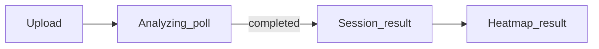

# Demo v1 — screen / data map

Framework-agnostic view-model: which prototype-aligned screens exist for Demo v1, what they do, and which parts of the frozen [analyze_result_spec.md](analyze_result_spec.md) (or job poll) they consume. Does not change the JSON contract or zone taxonomy.

**Demo v1 scope:** single-session happy path **Upload → Analyze → Result**. No multi-session history as real backend data (see [next_steps.md](next_steps.md) — cross-session progress explicitly later).

---

## Screen map

Aligned with prototype jump targets in [index.html](index.html) (Welcome, Dashboard, Upload, Analyzing, Session, Heatmap, Progress).

| Screen | What it does | Type | Data consumed |
|--------|----------------|------|----------------|
| **Welcome** | Product pitch + entry to app | shell/flow | None (static copy). |
| **Dashboard** | Hub: CTA to start upload; optional snapshot of the **current** run | shell/flow (+ optional result snippet) | **`summary`** only when a completed analysis exists in client/session state. Not `shot_points`, `zone_aggregates`, or `mapping` for Demo v1 unless you explicitly choose to mirror Session. Prototype “Recent trainings” / scores: **not** backed by AnalyzeResult in Demo v1 — treat as **placeholder shell** or omit from v1 scope. |
| **Upload** | Pick/record video; continue starts analyze (calibration payload when that milestone exists) | shell/flow | None from result; initiates `POST /analyze`. |
| **Analyzing** | Progress / wait for job | shell/flow | **Job poll only:** `status` (`processing`, `completed`, `failed`). On `failed`, user-facing **`error`** (top-level on failed response per spec). No `summary`, `shot_points`, `zone_aggregates`, or `mapping` until `completed`. |
| **Session** | Post-analysis summary: totals, accuracy, CTA to shot map | result | **`summary`** (required). **`zone_aggregates`** optional for a simple “weakest zone” style tip aligned with prototype copy — no new metrics. Prototype **consistency** / **score**: **not** in AnalyzeResult — **out of contract for v1** (omit, static placeholder, or non-claiming label). |
| **Heatmap** | Coarse court visualization + zone breakdown (not dense heatmap) | result | **`summary`** (topline attempts/made). **`shot_points`** (plot from **`origin.court`** when non-null; if `origin.court` is `null`, skip dot on the normalized court per stub rules). **`zone_aggregates`** for zone cards. **`mapping`** optional (e.g. debug/version); not required for core UI. |
| **Progress** | Prototype shows multi-session trends | shell/flow (Demo v1) | **No** AnalyzeResult consumption for real data in v1. Treat as **placeholder / static** or hide from primary demo path. |

---

## Navigation (prototype-aligned)

- **Session** → **Heatmap** (“Shot map”) for the same completed job.
- Bottom nav (Dashboard / Heatmap / Progress) matches prototype tabs; no extra backend endpoints required for this map.

---

## Failure path

If the job poll returns `failed`, **Session** and **Heatmap** are not populated from that job. User stays on **Analyzing** (or a dedicated error state) with **`status`** + **`error`** only — no reopening of the AnalyzeResult contract.

---

## Flow (happy path)

